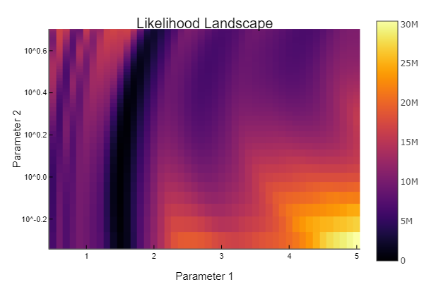
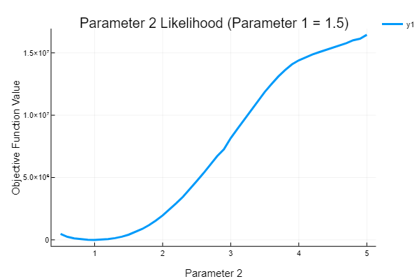

# Generalized Likelihood Inference

In this example we will demo the likelihood-based approach to parameter fitting.
First let's generate a dataset to fit. We will re-use the Lotka-Volterra equation
but in this case fit just two parameters.

```julia
f1 = function (du,u,p,t)
  du[1] = p[1] * u[1] - p[2] * u[1]*u[2]
  du[2] = -3.0 * u[2] + u[1]*u[2]
end
p = [1.5,1.0]
u0 = [1.0;1.0]
tspan = (0.0,10.0)
prob1 = ODEProblem(f1,u0,tspan,p)
sol = solve(prob1,Tsit5())
```

This is a function with two parameters, `[1.5,1.0]` which generates the same
ODE solution as before. This time, let's generate 100 datasets where at each point
adds a little bit of randomness:

```julia
using RecursiveArrayTools # for VectorOfArray
t = collect(range(0,stop=10,length=200))
function generate_data(sol,t)
  randomized = VectorOfArray([(sol(t[i]) + .01randn(2)) for i in 1:length(t)])
  data = convert(Array,randomized)
end
aggregate_data = convert(Array,VectorOfArray([generate_data(sol,t) for i in 1:100]))
```

here with `t` we measure the solution at 200 evenly spaced points. Thus `aggregate_data`
is a 2x200x100 matrix where `aggregate_data[i,j,k]` is the `i`th component at time
`j` of the `k`th dataset. What we first want to do is get a matrix of distributions
where `distributions[i,j]` is the likelihood of component `i` at take `j`. We
can do this via `fit_mle` on a chosen distributional form. For simplicity we
choose the `Normal` distribution. `aggregate_data[i,j,:]` is the array of points
at the given component and time, and thus we find the distribution parameters
which fits best at each time point via:

```julia
using Distributions
distributions = [fit_mle(Normal,aggregate_data[i,j,:]) for i in 1:2, j in 1:200]
```

Notice for example that we have:

```julia
julia> distributions[1,1]
Distributions.Normal{Float64}(μ=1.0022440583676806, σ=0.009851964521952437)
```

that is, it fit the distribution to have its mean just about where our original
solution was and the variance is about how much noise we added to the dataset.
This this is a good check to see that the distributions we are trying to fit
our parameters to makes sense.

Note that in this case the `Normal` distribution was a good choice, and in many
cases it's a nice go-to choice, but one should experiment with other choices
of distributions as well. For example, a `TDist` can be an interesting way to
incorporate robustness to outliers since low degrees of free T-distributions
act like Normal distributions but with longer tails (though `fit_mle` does not
work with a T-distribution, you can get the means/variances and build appropriate
distribution objects yourself).

Once we have the matrix of distributions, we can build the objective function
corresponding to that distribution fit:

```julia
using DiffEqParamEstim
obj = build_loss_objective(prob1,Tsit5(),LogLikeLoss(t,distributions),
                                     maxiters=10000,verbose=false)
```

First let's use the objective function to plot the likelihood landscape:

```julia
using Plots; plotly()
prange = 0.5:0.1:5.0
heatmap(prange,prange,[obj([j,i]) for i in prange, j in prange],
        yscale=:log10,xlabel="Parameter 1",ylabel="Parameter 2",
        title="Likelihood Landscape")
```



Recall that this is the negative loglikelihood and thus the minimum is the
maximum of the likelihood. There is a clear valley where the first parameter
is 1.5, while the second parameter's likelihood is more muddled. By taking a
one-dimensional slice:

```julia
plot(prange,[obj([1.5,i]) for i in prange],lw=3,
     title="Parameter 2 Likelihood (Parameter 1 = 1.5)",
     xlabel = "Parameter 2", ylabel = "Objective Function Value")
```



we can see that there's still a clear minimum at the true value. Thus we will
use the global optimizers from BlackBoxOptim.jl to find the values. We set our
search range to be from `0.5` to `5.0` for both of the parameters and let it
optimize:

```julia
using BlackBoxOptim
bound1 = Tuple{Float64, Float64}[(0.5, 5),(0.5, 5)]
result = bboptimize(obj;SearchRange = bound1, MaxSteps = 11e3)

Starting optimization with optimizer BlackBoxOptim.DiffEvoOpt{BlackBoxOptim.FitPopulation{Float64},B
lackBoxOptim.RadiusLimitedSelector,BlackBoxOptim.AdaptiveDiffEvoRandBin{3},BlackBoxOptim.RandomBound
{BlackBoxOptim.RangePerDimSearchSpace}}
0.00 secs, 0 evals, 0 steps
0.50 secs, 1972 evals, 1865 steps, improv/step: 0.266 (last = 0.2665), fitness=-737.311433781
1.00 secs, 3859 evals, 3753 steps, improv/step: 0.279 (last = 0.2913), fitness=-739.658421879
1.50 secs, 5904 evals, 5799 steps, improv/step: 0.280 (last = 0.2830), fitness=-739.658433715
2.00 secs, 7916 evals, 7811 steps, improv/step: 0.225 (last = 0.0646), fitness=-739.658433715
2.50 secs, 9966 evals, 9861 steps, improv/step: 0.183 (last = 0.0220), fitness=-739.658433715

Optimization stopped after 11001 steps and 2.7839999198913574 seconds
Termination reason: Max number of steps (11000) reached
Steps per second = 3951.50873439296
Function evals per second = 3989.2242527195904
Improvements/step = 0.165
Total function evaluations = 11106


Best candidate found: [1.50001, 1.00001]

Fitness: -739.658433715
```

This shows that it found the true parameters as the best fit to the likelihood.
