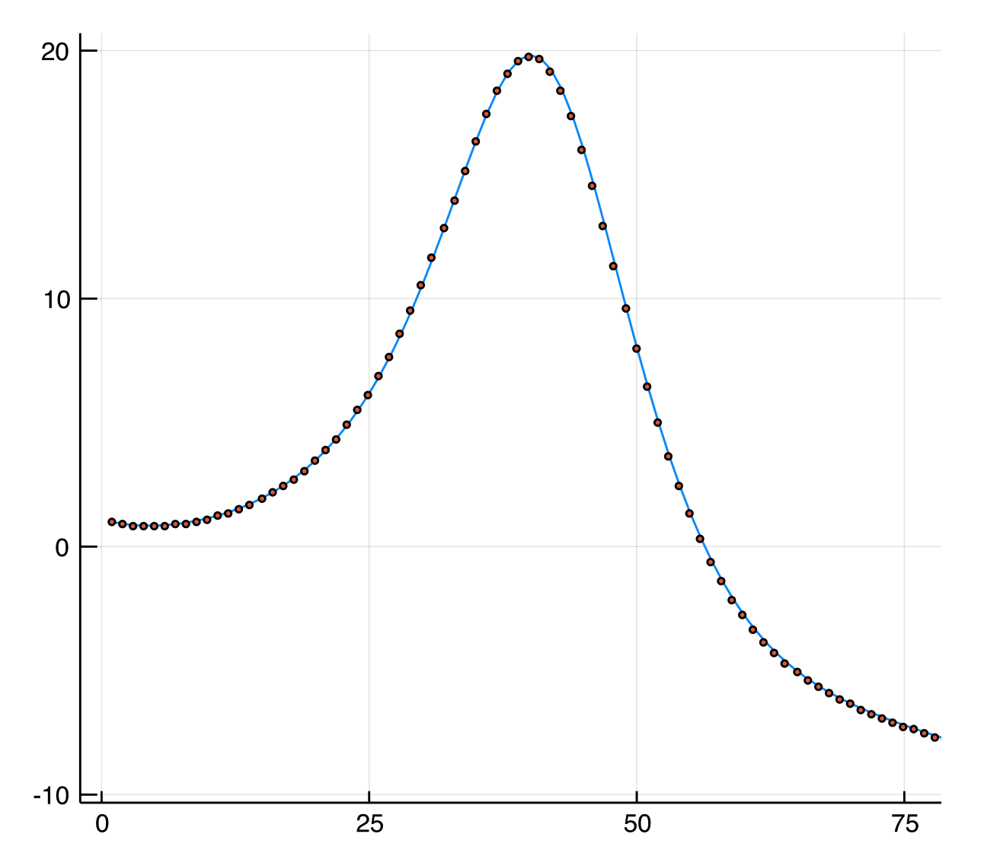

# Using JuMP with DiffEqParamEstim

[JuMP](https://github.com/JuliaOpt/JuMP.jl) is a domain-specific modeling language
for mathematical optimization embedded in Julia.

```julia
using OrdinaryDiffEq, DiffEqParamEstim, JuMP, NLopt, Plots
```
Let's define the Lorenz equation to use as our example

```julia
function g(du,u,p,t)
  σ,ρ,β = p
  x,y,z = u
  du[1] = dx = σ*(y-x)
  du[2] = dy = x*(ρ-z) - y
  du[3] = dz = x*y - β*z
end
```

Let's get a solution of the system with parameter values `σ=10.0` `ρ=28.0` `β=8/3` to use as our
data. We define some convenience functions `model_ode` (to create an `ODEProblem`) and `solve_model`(to obtain
solution of the `ODEProblem`) to use in a custom objective function later.

```julia
u0 = [1.0;0.0;0.0]
t = 0.0:0.01:1.0
tspan = (0.0,1.0)
model_ode(p_) = ODEProblem(g, u0, tspan,p_)
solve_model(mp_) = OrdinaryDiffEq.solve(model_ode(mp_), Tsit5(),saveat=0.01)
mock_data = Array(solve_model([10.0,28.0,8/3]))
```
Now we define a custom objective function to pass for optimization to JuMP using
the `build_loss_objective` described above provided by DiffEqParamEstim that defines an objective
function for the parameter estimation problem.

```julia
loss_objective(mp_, dat) = build_loss_objective(model_ode(mp_), Tsit5(), L2Loss(t,dat))
```

We create a JuMP model, variables, set the objective function and the choice of
optimization algorithm to be used in the JuMP syntax. You can read more about this in
JuMP's [documentation](http://www.juliaopt.org/JuMP.jl/0.18/index.html).

```julia
juobj(args...) = loss_objective(args, mock_data)(args)
jumodel = Model()
JuMP.register(jumodel, :juobj, 3, juobj, autodiff=true)
@variables jumodel begin
    σ,(start=8)
    ρ,(start=25.0)
    β,(start=10/3)
end
@NLobjective(jumodel, Min, juobj(σ, ρ, β))
setsolver(jumodel, NLoptSolver(algorithm=:LD_MMA))
```

Let's call the optimizer to obtain the fitted parameter values.

```julia
sol = JuMP.solve(jumodel)
best_mp = getvalue.(getindex.((jumodel,), Symbol.(jumodel.colNames)))
```
Let's compare the solution at the obtained parameter values and our data.

```julia
sol = OrdinaryDiffEq.solve(best_mp |> model_ode, Tsit5())
plot(getindex.(sol.(t),1))
scatter!(mock_data, markersize=2)
```

